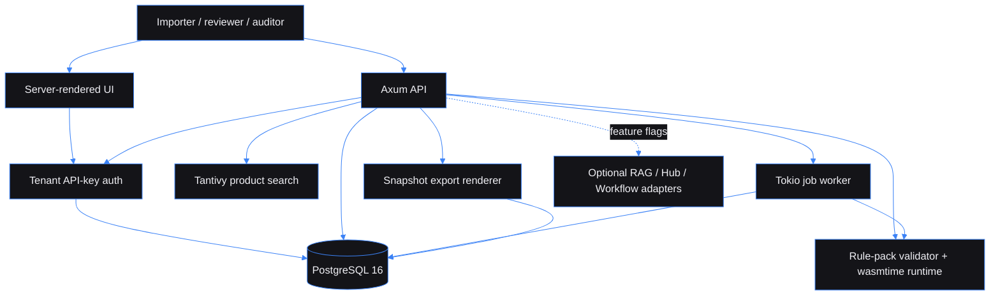

# Trade Compliance Classification Engine — evidence-backed customs classification for importer catalogs

Built by [Kingsley Onoh](https://kingsleyonoh.com) · Systems Architect

## The Problem

Import-heavy teams often make customs classification decisions in spreadsheets, then lose the reasoning when a reviewer changes a code or a rule changes later. This system turns product facts and versioned rule packs into tenant-scoped HS/HTS recommendations, review queues, and immutable audit packs, with a release gate of at least 85% exact-code accuracy, at most 20% review rate on clean fixtures, and zero false-low-risk denied/blocked fixtures.

## Architecture



## Key Decisions

- I chose tenant-scoped PostgreSQL records over a shared document blob because customs evidence has to survive audits, role checks, and historical reprints.
- I chose immutable rule-pack versions over in-place rule edits because a past classification must keep pointing at the exact rules that produced it.
- I chose PostgreSQL-backed job leasing over Redis for the MVP because the classification payload, retry state, and audit snapshots already live in Postgres.
- I chose local Tantivy search with optional RAG enrichment because the core classifier must run without any external AI service.
- I chose a server-rendered internal workbench over a polished SPA because the portfolio proof is the compliance engine: import, classify, review, and export.

## Setup

### Prerequisites

- Rust 1.78+
- Docker and Docker Compose
- PostgreSQL 16 via the included Compose file
- Node 20+ for Playwright E2E tests
- `psql` on PATH for the E2E helper tests

### Installation

```bash
git clone https://github.com/kingsleyonoh/trade-compliance-classification-engine.git
cd trade-compliance-classification-engine
cargo fetch
npm install
```

### Environment

```bash
cp .env.example .env
```

| Variable | Description |
|---|---|
| `DATABASE_URL` | PostgreSQL URL used by the app, setup command, migrations, and tests. |
| `DATABASE_MAX_CONNECTIONS` | Maximum sqlx pool size. |
| `DATABASE_MIN_CONNECTIONS` | Minimum sqlx pool size. |
| `DATABASE_ACQUIRE_TIMEOUT_SECONDS` | Connection acquire timeout for the database pool. |
| `APP_BASE_URL` | Public/base URL used by local browser tests and generated links. |
| `APP_BIND_ADDR` | Socket address the Axum server binds to. |
| `SELF_REGISTRATION_ENABLED` | Enables or disables public tenant registration. |
| `JWT_SECRET` | Application signing secret placeholder; set from secrets in production. |
| `API_KEY_PEPPER` | Pepper used when hashing tenant API keys. |
| `RUST_LOG` | Rust tracing filter. |
| `SENTRY_DSN` | Optional Sentry DSN. Empty disables Sentry. |
| `RAG_PLATFORM_ENABLED` | Enables optional RAG evidence lookup. |
| `RAG_PLATFORM_URL` | Optional Multi-Agent RAG Platform URL. |
| `RAG_PLATFORM_API_KEY` | Optional RAG API key from secrets. |
| `NOTIFICATION_HUB_ENABLED` | Enables optional Notification Hub events. |
| `NOTIFICATION_HUB_URL` | Optional Notification Hub URL. |
| `NOTIFICATION_HUB_API_KEY` | Optional Notification Hub API key from secrets. |
| `WORKFLOW_ENGINE_ENABLED` | Enables optional Workflow Engine high-risk triggers. |
| `WORKFLOW_ENGINE_URL` | Optional Workflow Engine URL. |
| `WORKFLOW_ENGINE_API_KEY` | Optional Workflow Engine API key from secrets. |
| `WORKFLOW_HIGH_RISK_REVIEW_ID` | Optional workflow id for high-risk review escalation. |

### Run

```bash
docker compose up -d
cargo run --bin setup
cargo run --bin trade-compliance-classification-engine
```

The setup command prints a one-time demo API key. Open `http://127.0.0.1:8080/ui/login`, paste that key, and use the internal workbench.

## How It Works

```text
1. Tenant registers or setup seeds a demo tenant and API key.
2. Admin uploads a rule pack with golden cases and activates it.
3. Classifier imports products with material/use-case facts.
4. Classification jobs lease queued products and run the active rule pack.
5. The run stores selected code, rejected candidates, confidence, risk band, and explanation.
6. Reviewer can append an override without erasing the machine decision.
7. Auditor creates an audit export from a frozen snapshot and downloads the evidence pack.
```

## Usage

### Fastest path: use the workbench

```bash
docker compose up -d
cargo run --bin setup
cargo run --bin trade-compliance-classification-engine
```

Then open `http://127.0.0.1:8080/ui/login` and sign in with the setup API key.

Core screens:

| Screen | Route | What it does |
|---|---|---|
| Dashboard | `/ui/dashboard` | Shows product, queue, and export counts. |
| Rule packs | `/ui/rule-packs` | Upload, validate, and activate versioned rules. |
| Import products | `/ui/products/import` | Add products with material and intended-use facts. |
| Products | `/ui/products` | Select ready products and run classifications. |
| Classifications | `/ui/classifications` | Open classification details and evidence traces. |
| Reviews | `/ui/reviews` | Record structured reviewer overrides. |
| Audit exports | `/ui/audit-exports` | Download immutable JSON audit packs. |
| Integrations | `/ui/integrations` | Shows optional adapters as disabled/non-blocking unless configured. |

### API journey

All protected API calls use the tenant API key:

```bash
API_KEY="paste-the-setup-or-registration-key"
BASE="http://127.0.0.1:8080"
```

Register a tenant when self-registration is enabled:

```bash
ADMIN_CONTACT="set-a-local-admin-contact"

curl -s -X POST "$BASE/api/tenants/register" \
  -H 'content-type: application/json' \
  -d "{
    \"legal_name\":\"Northstar Apparel\",
    \"full_legal_name\":\"Northstar Apparel Limited\",
    \"display_name\":\"Northstar\",
    \"address\":{\"line1\":\"1 Trade Way\"},
    \"registration\":{\"number\":\"NS-001\"},
    \"contact\":{\"name\":\"Compliance Lead\"},
    \"wordmark\":\"Northstar\",
    \"regulator_ids\":{},
    \"admin_email\":\"$ADMIN_CONTACT\"
  }"
```

Upload and activate a rule pack:

```bash
curl -s -X POST "$BASE/api/rule-packs" \
  -H "x-api-key: $API_KEY" \
  -H 'content-type: application/json' \
  -d '{
    "name":"us-apparel-rules",
    "version":"2026.1",
    "jurisdiction":"US",
    "source":"{\"rules\":[{\"id\":\"shirt\",\"code\":\"6205.20\",\"contains\":\"shirt\",\"confidence\":0.91,\"risk_band\":\"low\"}],\"golden_cases\":[{\"product\":{\"description\":\"woven cotton shirt\",\"materials\":[\"cotton\"]},\"expected_code\":\"6205.20\"}],\"coverage\":{\"outputs\":[\"hs_hts_recommendation\",\"duty_estimate\",\"risk_band\",\"audit_pack\",\"denied_goods_flag\"]}}"
  }'
```

Import a product and run classification:

```bash
curl -s -X POST "$BASE/api/products/import" \
  -H "x-api-key: $API_KEY" \
  -H 'content-type: application/json' \
  -d '{"rows":[{"sku":"SHIRT-001","name":"Woven shirt","description":"woven cotton shirt for retail sale","country_of_origin":"NG","jurisdiction":"US","product_type":"apparel","materials":["cotton"],"intended_use":"retail sale"}]}'

curl -s -X POST "$BASE/api/classifications/run" \
  -H "x-api-key: $API_KEY" \
  -H 'content-type: application/json' \
  -d '{"product_ids":["<product-id>"]}'
```

Fetch the result and export evidence:

```bash
curl -s "$BASE/api/classifications/<run-id>" -H "x-api-key: $API_KEY"

curl -s -X POST "$BASE/api/classifications/<run-id>/override" \
  -H "x-api-key: $API_KEY" \
  -H 'content-type: application/json' \
  -d '{"override_code":"6205.30","reason_code":"supplier_evidence","note":"Supplier composition certificate changed the code.","structured_correction":{"source":"supplier_certificate"}}'

curl -s -X POST "$BASE/api/audit-exports" \
  -H "x-api-key: $API_KEY" \
  -H 'content-type: application/json' \
  -d '{"classification_run_id":"<run-id>","format":"json"}'

curl -s "$BASE/api/audit-exports/<export-id>/download" -H "x-api-key: $API_KEY"
```

### What it handles

| Concern | System behavior |
|---|---|
| Tenant isolation | Every product, rule pack, run, override, export, and integration setting is tenant-owned. |
| Explainability | Classification runs persist selected code, rejected candidates, confidence, risk band, explanation, and rule-pack version. |
| Versioning | Activating a new rule pack retires the previous active pack without changing historical runs. |
| Review trail | Overrides append to history and preserve the original machine decision. |
| Audit evidence | Exports render from frozen snapshots instead of re-reading mutable product or tenant records. |
| Optional adapters | RAG, Notification Hub, and Workflow Engine are feature-flagged and non-blocking. |

### Endpoint reference

| Method | Path | Purpose |
|---|---|---|
| `POST` | `/api/tenants/register` | Register tenant and issue API key when enabled. |
| `GET` | `/tenants/me` | Inspect current tenant/user context. |
| `POST` | `/api/products/import` | Import CSV/JSON product catalog rows. |
| `GET` | `/api/products` | List tenant products. |
| `POST` | `/api/rule-packs` | Upload a rule pack. |
| `POST` | `/api/rule-packs/:id/validate` | Validate uploaded rules and golden cases. |
| `POST` | `/api/rule-packs/:id/activate` | Activate a valid immutable rule-pack version. |
| `POST` | `/api/classifications/run` | Queue classification jobs. |
| `GET` | `/api/classifications/:id` | Read classification evidence. |
| `POST` | `/api/classifications/:id/override` | Append reviewer correction. |
| `POST` | `/api/audit-exports` | Create a frozen audit export. |
| `GET` | `/api/audit-exports/:id/download` | Download the export. |
| `GET` | `/health`, `/health/db`, `/health/ready` | Health and readiness checks. |
| `GET` | `/metrics` | Prometheus metrics, API-key protected. |

## Tests

```bash
cargo fmt --all -- --check
cargo test -- --test-threads=1
cargo clippy --all-targets --all-features -- -D warnings
cargo run --bin backtest
bash scripts/scan-secrets.sh --mode all
npx playwright test
```

## AI Integration

This project includes machine-readable public context for external tools:

| File | What it does |
|------|-------------|
| [`openapi.yaml`](openapi.yaml) | OpenAPI 3.1 API specification |
| [`llms.txt`](llms.txt) | LLM-oriented project summary and entry points |
| [`mcp.json`](mcp.json) | MCP discovery metadata |

## Deployment

This project ships with a production Compose file and a GitHub Actions workflow that builds a GHCR image. No public live URL is configured in this repository yet.

### Production Stack

| Component | Role |
|-----------|------|
| `app` | Rust/Axum service exposing the API, UI, workers, health checks, and metrics. |
| PostgreSQL | Required external database supplied through `DATABASE_URL`. |
| Optional RAG Platform | Evidence search adapter, disabled by default. |
| Optional Notification Hub | Fire-and-forget reviewer/admin events, disabled by default. |
| Optional Workflow Engine | High-risk review escalation, disabled by default. |

### Self-Host

```bash
# Build locally
docker build -t trade-compliance-classification-engine:latest .

# Or use the compose file after setting environment variables
docker compose -f docker-compose.prod.yml up -d
```

Set the environment variables listed in **Setup > Environment** before starting.

<!-- THEATRE_LINK -->
